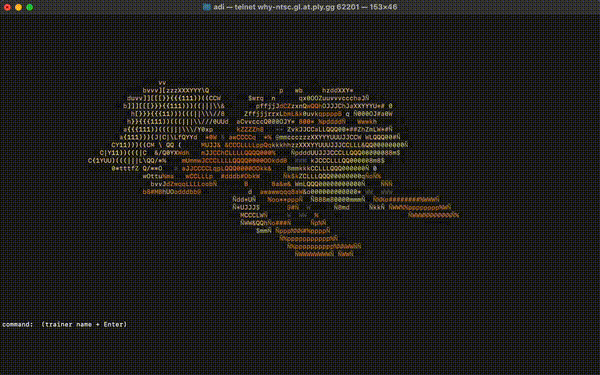

# Poke-Stream
Visit [https://pokestream.me](url) for product details



Terminal-hosted Pokemon game with real-time ASCII animation. Players connect over Telnet to play and catch Pokemon while a 3D, ray-cast Pokeball animates over 2D Pokemon art, all rendered as colored ASCII characters. The server is written in Rust and uses Tokio to run one game loop per connection.

## Features
- Telnet-playable game loop with a welcome screen and capture sequence.
- Hybrid renderer: 2D ASCII sprites plus a 3D shaded sphere with z-buffering.
- Color-aware ASCII rendering with truecolor, ANSI 256, or monochrome output.
- Async TCP server that spawns a session task per client.
- Asset pipeline that converts PNG/JPG/GIF into colored ASCII frames.
- Pokedex grid with per-trainer capture tracking and entry detail view.

## Play (Public Server)
From any terminal with Telnet installed:

```bash
telnet why-ntsc.gl.at.ply.gg 62201
```

If your terminal supports 24-bit color, set:

```bash
POKESTREAM_COLOR=truecolor
```

Recommended terminal size is at least 140x40.

## Screens and Controls
### Welcome Screen (Trainer Setup)
Players join on the welcome screen and enter a unique trainer name. This name keys their Pokedex state in SQLite.

Commands:
- Enter a trainer name to start the session
- `q`, `quit`, or `exit` to leave

### Catch Screen (Main Game)
The main loop renders the rotating Pokeball and a random Pokemon sprite. Players can attempt a capture, which triggers the Pokeball throw, opening, absorption stream, closing, wobble, and star-burst sequence. A capture message appears before the game resets to a new Pokemon.


Commands:
- `catch` to throw the Pokeball
- `pokedex` or `dex` to open the Pokedex
- `q`, `quit`, or `exit` to leave

### Pokedex Screen (Captured Grid)
The Pokedex shows all Gen 1 entries in a numbered grid (15 per row). Captured entries are colored; uncaught entries are dimmed.

Commands:
- Type a caught Pokemon number (1-151) to open its detail page
- `back` to return to the main game
- `q`, `quit`, or `exit` to leave

### Pokedex Detail Screen (Single Entry)
Displays the captured Pokemon's ASCII sprite with its name below. If the sprite asset is not available yet, a placeholder message is shown.

Commands:
- `back` to return to the Pokedex grid
- `q`, `quit`, or `exit` to leave

## Exiting Telnet
After the game closes, exit your Telnet client:

```text
Press Ctrl + ]
Type quit
```

## Architecture Summary
- **Session model**: `src/main.rs` binds on `0.0.0.0:8080` and spawns one Tokio task per connection. Each task maintains its own `SessionState` with render buffers, game state, and trainer Pokedex.
- **Screen state machine**: `Screen::Name`, `Screen::Game`, `Screen::Pokedex`, `Screen::PokedexDetail` drive the input handling, animation updates, and render output.
- **Game state machine**: `Idle`, `Throwing`, `Opening`, `Absorbing`, `Closing`, `Shaking`, `StarHold` define the capture flow, including stream particles and star burst timing.
- **Renderer**:
  - **2D layer**: ASCII Pokemon sprites with per-character color from `src/ascii.rs`.
  - **3D layer**: Ray-cast shaded sphere (Pokeball) with z-buffering and lighting.
  - **Composition**: character output, color buffer, and z-buffer merged per frame with ANSI color output.
- **Asset pipeline**: `src/pokemon.rs` loads PNG/JPG/GIF assets and converts them into `AsciiImage` frames. `src/ascii.rs` handles resize, edge-based shading, and background removal.
- **Persistence**: trainer Pokedex is stored in SQLite (`pokedex.db`) as a per-trainer set of caught Pokemon names.
- **Pokedex view**: `sample_images/gen01.csv` provides numbered Gen 1 names to drive the 15x11 grid layout.

## Configuration
Color mode selection (optional):
- `POKESTREAM_COLOR=truecolor` or `24bit`
- `POKESTREAM_COLOR=ansi256` or `256`
- `POKESTREAM_COLOR=mono` or `none`

If unset, the server auto-detects color support via `COLORTERM` and `TERM`.

## Tech Stack
- Rust (edition 2024)
- Tokio for async networking
- Image crate for asset decoding and GIF frames

## Project Context
This project is a terminal-native, distributed-systems style experiment: a single server process accepts multiple Telnet sessions and runs an independent animation loop per client. The goal is to support many concurrent users with low latency rendering while keeping everything in ASCII.

## Roadmap
- Improve the Pokemon art assets and add more species.
- Externalize session state (planned Redis-backed pokedex/session store).
- Explore higher concurrency targets with profiling and load testing.
